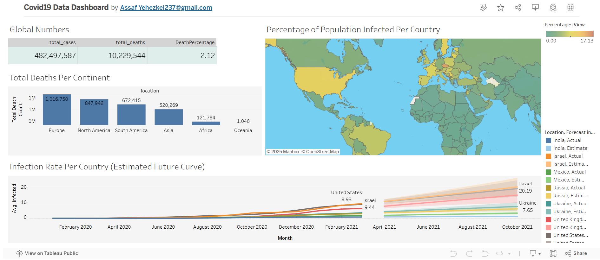

# COVID-19 Data Analysis & Visualization

This project analyzes global COVID-19 data using SQL and visualizes insights using Tableau.



[Tableau Dashboard Link](https://public.tableau.com/app/profile/assaf.yehezkel237/viz/Covid19DataDashboard_17427464810690/Dashboard1?publish=yes)

## 📂 Dataset
The dataset is sourced from [Our World in Data](https://ourworldindata.org/coronavirus) and consists of two tables:
- `CovidDeaths`: Contains COVID-19 cases, deaths, and population data.
- `CovidVaccinations`: Contains vaccination data.

## Key SQL Queries

### 1. Global Summary

Calculates total cases, total deaths, and the death percentage worldwide.

```sql
SELECT
    SUM(CAST(new_cases AS INT)) AS total_cases,
    SUM(CAST(new_deaths AS INT)) AS total_deaths,
    (SUM(CAST(new_deaths AS INT)) * 1.0) / NULLIF(SUM(CAST(new_cases AS INT), 0) * 100) AS DeathPercentage
FROM PortfolioProject..CovidDeaths
WHERE continent IS NOT NULL
ORDER BY 1, 2;
```

### 2. Countries with Highest Death Counts

Finds locations with the highest reported COVID-19 deaths.

```sql
SELECT location, SUM(CAST(new_deaths AS INT)) AS TotalDeathCount
FROM PortfolioProject..CovidDeaths
WHERE continent = ' ' AND location NOT IN ('World', 'European Union', 'International')
GROUP BY location
ORDER BY TotalDeathCount DESC;
```

### 3. Highest Infection Rate per Population

Identifies countries with the highest infection rates compared to their population.

```sql
SELECT
    Location,
    Population,
    MAX(CAST(total_cases AS BIGINT)) AS HighestInfectionCount,  
    MAX(CAST(total_cases AS BIGINT)) * 1.0 / NULLIF(CAST(Population AS BIGINT), 0) * 100 AS PercentPopulationInfected
FROM PortfolioProject..CovidDeaths
WHERE location NOT IN ('International')
GROUP BY Location, Population
ORDER BY PercentPopulationInfected DESC;
```

### 4. Daily Infection Percentage

Tracks infection percentage over time for different countries.

```sql
SELECT Location, Population, date,
    MAX(CAST(total_cases AS BIGINT)) * 1.0 / NULLIF(CAST(Population AS BIGINT), 0) * 100 AS PercentPopulationInfected
FROM PortfolioProject..CovidDeaths
WHERE location NOT IN ('International', 'Northern Cyprus')
GROUP BY Location, Population, date
ORDER BY PercentPopulationInfected DESC;
```
## Tableau Dashboard
The SQL queries above are used to create visualizations in Tableau, including:

- **Global Summary of Cases & Deaths**
- **Total Deaths By Continent**
- **Countries with the Highest Infection Rate**
- **Infection Trends Over Time**


